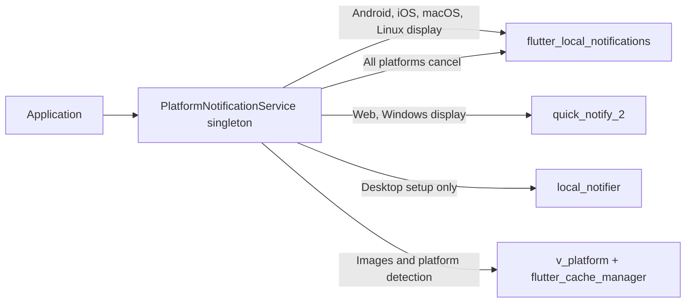

# Platform Local Notifications: Modernization Report

**Assessment date:** 2026-08-16
**Baseline:** `main` at `1195604` (`platform_local_notifications` 2.1.0)
**Scope:** Architecture, API, dependencies, tests, documentation, package health, and representative platform builds.

> **2026-08-17 update:** Release 2.2.0 adopts `v_platform` 2.2.0 for its WASM-safe conditional file helpers and removal of browser-DOM dependencies. `quick_notify_2` remains the package's outstanding WASM blocker, so the broader backend modernization recommendations still apply.

## Executive Conclusion

The package provides a useful cross-platform facade, but its current implementation is not yet a reliable six-platform abstraction. The source analyzes cleanly and the six root unit tests pass, yet only 7.8% of executable lines are covered and the 628-line core service has no coverage. More importantly, initialization, display, cancellation, payloads, and actions are routed through different plugins on different platforms, producing inconsistent behavior.

A blind dependency upgrade is not recommended. `flutter_local_notifications` 22.3.0 changes APIs and raises platform/toolchain floors, while this package re-exports that plugin's entire public API. The safe target is a deliberately versioned 3.0 release that uses one backend where possible, narrows the public API, introduces testable platform adapters, and proves each advertised platform in CI and on devices.

No source code or dependency was changed during this assessment. Builds and upgrade experiments ran in an isolated archive so the existing working tree was preserved.

## Current Architecture

This routing is the central design problem. macOS and Linux display through `flutter_local_notifications` without corresponding initialization; Windows and web display through `quick_notify_2`, but cancellation always calls `flutter_local_notifications`. The desktop plugin is initialized but never used to display or cancel. Web/Windows notification IDs and payloads are also discarded by the selected backend path.

## Repository and Package Baseline

| Area | Observed state |
|---|---|
| Package | 2.1.0; Dart `>=3.0.0 <4.0.0`; Flutter `>=3.3.0` |
| Toolchain used | Flutter 3.44.1 stable; Dart 3.12.1; Xcode 26.0.1; CocoaPods 1.16.2; Java 18 |
| Code size | 1,582 Dart lines; service alone is 628 lines |
| Public package status | 14 likes, 436 downloads, 140/160 pub points at assessment time |
| Automation | No repository CI or dependency-update automation |
| Release hygiene | Latest commit labels 2.1.0, but the only Git tag is `v2.0.0`; no GitHub Release exists |
| Open upstream work | [Issue #5](https://github.com/hatemragab/platform_local_notifications/issues/5) requests WASM support; [PR #6](https://github.com/hatemragab/platform_local_notifications/pull/6) is open but should not be merged as-is. See the detailed [WASM support plan](./WASM_SUPPORT_PLAN.md). |

## Validation Results

All mutating validation was performed in an isolated checkout. The example's dependency path temporarily had to be corrected from `../../platform_local_notifications` to `..` because the committed path only resolves when the repository directory has one exact name and parent layout.

| Command/check | Result | Interpretation |
|---|---|---|
| `git pull --ff-only` | Passed: already up to date | Local `main` matched `origin/main` at audit time |
| `flutter pub get` | Failed in a standalone checkout until the example path was corrected | The package is not portable as an archive or differently named clone |
| `flutter analyze --no-pub` | Passed after the temporary path correction | Current Dart source has no analyzer findings |
| `dart format --output=none --set-exit-if-changed ...` | Failed; six files would change | Formatting is not clean under Dart 3.12 |
| `flutter test --no-pub --coverage` | 6 tests passed; 24/307 lines (7.8%) covered | Core behavior is effectively untested; service coverage is 0% |
| Example widget test | Failed at `example/test/widget_test.dart:19` | Test is the obsolete Flutter counter template, not the notification demo |
| `flutter pub publish --dry-run` | Warning for stable package depending on prerelease `quick_notify_2` | Current dependency policy is unsuitable for a stable release |
| Web JavaScript build | Passed | Traditional web compilation currently works |
| Web WASM build | Failed at the 2.1.0 baseline | `v_platform` 2.2.0 removes its legacy imports; `quick_notify_2` remains incompatible |
| Android debug build | Passed with upgrade warnings | Gradle 8.12, AGP 8.7.3, and Kotlin 2.1.0 are approaching Flutter's unsupported range |
| iOS simulator build | Passed after Flutter migrated generated project files | Committed example scaffolding is stale; minimum iOS target was raised to 13 |
| macOS debug build | Passed after generated-project migration | `local_notifier` uses APIs deprecated since macOS 11 and lacks Swift Package Manager support |

Linux and Windows native builds were not available on the macOS audit host. Successful compilation does not prove notification permissions, delivery, action callbacks, or cold-start behavior; these require real-platform integration tests.

## Dependency Assessment

| Dependency | Committed resolution | Fresh compatible | Current upstream | Recommendation |
|---|---:|---:|---:|---|
| `flutter_local_notifications` | 19.4.0 | 19.5.0 | 22.3.0 | Upgrade only as part of the planned major migration |
| `flutter_cache_manager` | 3.4.1 | 3.4.2 | 3.4.2 | Patch-update after image-path tests exist |
| `local_notifier` | 0.1.6 | 0.1.6 | 0.1.6 | Remove after consolidating the desktop backend |
| `quick_notify_2` | 0.3.0-dev.0 | Same | Same | Remove; prerelease, inactive, and blocks stable publishing/WASM |
| `v_platform` | 2.1.4 | 2.2.0 | 2.2.0 | Adopted in 2.2.0; retain for compatibility and reassess public coupling in 3.0 |
| `flutter_lints` | 6.0.0 | 6.0.0 | 6.0.0 | Keep |

The latest [`flutter_local_notifications` changelog](https://pub.dev/packages/flutter_local_notifications/changelog) shows that version 20 converted major methods such as `initialize`, `show`, and `cancel` to named arguments. Version 21 requires Flutter 3.38.1, Dart 3.10, Android API 24, iOS 13, macOS 10.15, compile SDK 36, and AGP 8.11.1. Version 22 adds web support. A temporary constraint change to 22.3.0 resolved successfully but produced seven source diagnostics: the named-argument migrations and a new `notificationDismissed` response enum case. This suggests a manageable code migration, but the platform and public-API consequences make it a major release.

The package's [pub.dev score](https://pub.dev/packages/platform_local_notifications/score) currently loses points for an outdated dependency constraint and WASM-incompatible transitive imports. `quick_notify_2` is still a prerelease package with a small maintenance footprint, while [`local_notifier`](https://pub.dev/packages/local_notifier) is desktop-only and generated deprecation warnings in the macOS build.

## Correctness and API Findings

| Priority | Finding | Required action |
|---|---|---|
| P0 | Display and cancel use different backends on web/Windows; macOS/Linux use an uninitialized display backend | Consolidate backend routing and add per-platform contract tests before release |
| P0 | Published six-platform claims exceed tested behavior | Define and prove a feature matrix for permission, display, cancel, payload, actions, and launch handling |
| P1 | `initialize()` mutates configuration before its initialized guard and is race-prone; `dispose()` permanently closes singleton-owned ports/streams | Introduce an explicit, idempotent lifecycle and make reinitialization safe or unsupported by contract |
| P1 | `NotificationData.androidNotificationChannel` does not control the default Android channel; channel description is used as its name | Normalize channel configuration and test channel creation/display together |
| P1 | Background handlers launch cancellation futures without awaiting them and log payload/reply content | Await or safely report failures and remove potentially sensitive diagnostic content |
| P1 | `NotificationData` and `NotificationConfiguration` duplicate concepts, while only one drives the service | Publish one validated configuration model and deprecate the duplicate |
| P1 | README/API docs promise automatic validation and `isValid`, but neither model implements it | Implement validation or remove the claims; add invalid-input tests |
| P2 | Nullable `copyWith` fields cannot be cleared because `null` means “retain old value” | Use a sentinel/wrapper pattern for nullable replacements |
| P2 | Chat support is reported for iOS, but chat-specific rendering is implemented only for Android | Implement and test iOS categories/attachments or narrow the capability claim |
| P2 | The package exports all of `flutter_local_notifications` | Replace the broad export with intentional package-owned types or explicitly accept upstream API coupling |
| P2 | Static singleton construction prevents practical backend mocking | Inject an interface-backed notification adapter and cache/file services |
| P3 | README examples pass a string where `VPlatformFile` is required; method signatures include a nonexistent `context` parameter | Generate examples from tested source or add documentation snippet tests |
| P3 | Changelog dates contain `XX`; example identifiers and metadata remain generic | Repair release metadata before the next tag |

Generated root plugin metadata is tracked even though it embeds developer-specific absolute paths. The root lockfile is also tracked while `.gitignore` says library lockfiles should not be committed. Establish one documented policy, remove generated root metadata from version control, and make CI reject absolute local paths.

## Recommended Target Architecture

1. **One platform contract.** Define package-owned operations for initialize, permission, show, cancel, launch details, and action events. Each advertised platform must implement or explicitly reject each capability.
2. **One primary backend.** Use `flutter_local_notifications` 22.x for Android, iOS, macOS, Linux, Windows, and web where its feature support satisfies the contract. Remove `quick_notify_2` and `local_notifier` after verification.
3. **Stable package-owned models.** Stop broadly re-exporting the upstream plugin. Expose deliberate models and enums, with translation isolated inside the adapter.
4. **WASM-safe image input.** Replace the broad `v_platform` dependency with a small package-owned image source abstraction (bytes, URL, or supported local file). Keep `flutter_cache_manager` only if remote image caching remains part of the contract.
5. **Testable lifecycle.** Inject the backend, cache, clock/ID source, and action transport. Represent initialization with explicit states and preserve safe repeated calls.
6. **Structured failures.** Validate IDs, titles, payload sizes, platform details, and chat data. Return or throw documented typed failures rather than silently logging and continuing.

PR #6 contains useful WASM intent but should not be merged directly: it replaces the public file type incompatibly, points a dependency at an unpinned Git `main` branch, commits generated metadata containing contributor-local paths, adds no service coverage, and retains the backend that causes the WASM problem. Reimplement the useful ideas behind a tested compatibility plan.

## Prioritized Delivery Plan

### Phase 0 — Reproducible Baseline (0.5–1 day)

- Fix the example dependency to `path: ..` and replace the stale widget test.
- Format the six reported files and make format checking mandatory.
- Regenerate the Android, iOS, macOS, web, Linux, and Windows example scaffolding with the supported Flutter version, reviewing every generated diff.
- Remove tracked root plugin metadata and settle the library lockfile policy.
- Correct README signatures, `VPlatformFile` examples, validation claims, changelog dates, package metadata, tags, and release notes.

**Exit gate:** clean clone can resolve, analyze, test, build the example, and complete a warning-free publish dry run.

### Phase 1 — Lock the Existing Contract (2–3 days)

- Introduce an injectable backend interface around the current behavior.
- Add unit tests for initialization, repeated calls, routing, permissions, display, cancel, payloads, channel selection, actions, and disposal.
- Fix cancellation routing, async error handling, sensitive logs, Android channel mapping, nullable `copyWith`, and lifecycle races.
- Define a written platform capability matrix and align README claims with tested behavior.

**Exit gate:** core service coverage at least 80%, total coverage at least 75%, with no unsupported capability reported as available.

### Phase 2 — Version 3 Dependency and API Migration (3–4 days)

- Raise SDK/toolchain floors deliberately and upgrade `flutter_local_notifications` to 22.x.
- Migrate named arguments and handle `notificationDismissed` explicitly.
- Add all applicable upstream initialization settings and verify web permissions.
- Remove `quick_notify_2` and `local_notifier`; retain WASM-safe `v_platform` 2.2.0 or replace it with a package-owned image abstraction.
- Introduce the package-owned image/configuration API, providing deprecations in a transitional 2.x release if downstream migration time is needed.
- Replace the upstream wildcard export with intentional compatibility exports.

**Exit gate:** JavaScript and WASM web builds pass; Android, iOS, macOS, Linux, and Windows compile against documented minimum versions.

### Phase 3 — Platform Proof and Release (2–4 days plus device access)

- Add device/integration scenarios for permission denial, display, cancellation, foreground/background actions, text input, and cold-start launch.
- Verify images, chat/group behavior, channels, and payload round trips on every supported platform.
- Publish a migration guide with before/after examples and exact minimum versions.
- Create a signed/annotated tag and matching GitHub Release only after CI artifacts are green.

Indicative engineering effort is 7–12 focused days plus access to Windows/Linux runners and representative physical mobile devices. Feature gaps discovered during device verification may extend that range.

## Required CI and Release Gates

- `dart format --output=none --set-exit-if-changed lib test example/lib example/test`
- `flutter analyze`
- Root and example tests with enforced coverage thresholds
- `flutter pub publish --dry-run` with zero warnings
- Web JavaScript and `flutter build web --wasm`
- Android debug/release compilation; iOS and macOS compilation on macOS
- Linux and Windows example compilation on native runners
- Dependency review and scheduled update PRs
- Check that archives contain no generated plugin metadata, secrets, or absolute workstation paths
- Real-platform smoke evidence for every capability claimed in the README

## Recommended First Implementation Slice

Start with Phase 0 and the injectable adapter from Phase 1 in one focused branch. That creates a trustworthy baseline without immediately changing the public API. Once current behavior is covered, perform the 22.x migration and backend consolidation as a separate 3.0 branch. Avoid `pub upgrade --major-versions` as a first step and do not publish another stable version while a prerelease dependency remains.

## Primary References

- [`platform_local_notifications` on pub.dev](https://pub.dev/packages/platform_local_notifications)
- [`flutter_local_notifications` package](https://pub.dev/packages/flutter_local_notifications) and [changelog](https://pub.dev/packages/flutter_local_notifications/changelog)
- [`quick_notify_2` package](https://pub.dev/packages/quick_notify_2)
- [Flutter WebAssembly documentation](https://docs.flutter.dev/platform-integration/web/wasm)
